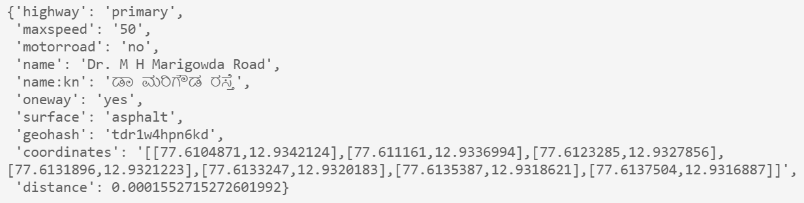

# OpenStreetMap Roads
The package takes an openstreetmap pbf file and converts it to a Trie with all the road network information
It provides an api to then do a fast map matching for any latitude, longitude that comes under the bounding box of the pbf file. 

## Importing and loading the pbf file
from osm_roads.osm_roads import OsmRoads

way_finder = OsmRoads()
way_finder.load_osm_pbf("bengaluru.pbf")

## Search for map matching with latitude and longitude 

way_finder.get_road_type(12.934005898750094, 77.61075025215672)

## Saving the current PBF to a trie 
way_finder.export_trie('bangalore_updated.trie')

## Loading the trie from file 
way_finder.load_trie('bangalore_updated.trie')

### How to get PBF files and slice them 
1. Visit the [OpenStreetMap Wiki](https://wiki.openstreetmap.org/wiki/Planet.osm). The file used in the example is downloaded from [GeoFabrik](https://download.geofabrik.de/asia/india.html), one of the mirrors of OSM and sliced using Osmium Tool

2. Install the Osmium Tool (works well in linux). sudo apt-get install -y osmium-tool
3. Run "osmium extract -b 77.343833,13.159493,77.905509,12.830316 southern-zone-latest.osm.pbf -o bengaluru.pbf" (replace the bounding box lat,lons as per your need)

