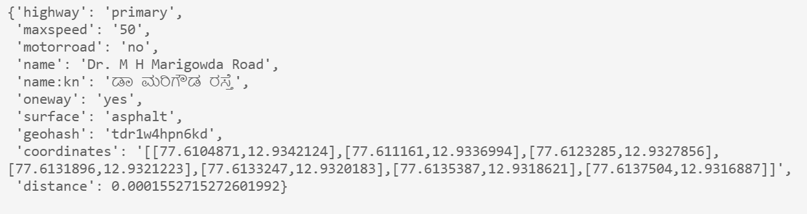

# OpenStreetMap Roads
The package takes an openstreetmap pbf file and converts it to a geohash prefix based hdf5 file. 
It provides an api to then do a fast map matching for any latitude, longitude that comes under the bounding box of the pbf file. 
### Installation
pip install osm-roads

## Importing and loading the pbf file
from osm_roads.osm_roads import OsmRoads

osm_roads=OsmRoads(hdf5_file_name="bengaluru.hdf5",openstreetmap_pbf_file_name="bengaluru.pbf")

## Closing the file handler 

## Opening the HDF5 osm file 
osm_roads=OsmRoads(hdf5_file_name="bengaluru.hdf5")

## Search for map matching with latitude and longitude 

osm_roads.get_closest_road(12.934005898750094, 77.61075025215672)

### How to get PBF files and slice them 
1. Visit the [OpenStreetMap Wiki](https://wiki.openstreetmap.org/wiki/Planet.osm). The file used in the example is downloaded from [GeoFabrik](https://download.geofabrik.de/asia/india.html), one of the mirrors of OSM and sliced using Osmium Tool

2. Install the Osmium Tool (works well in linux). sudo apt-get install -y osmium-tool
3. Run "osmium extract -b 77.343833,13.159493,77.905509,12.830316 southern-zone-latest.osm.pbf -o bengaluru.pbf" (replace the bounding box lat,lons as per your need)

